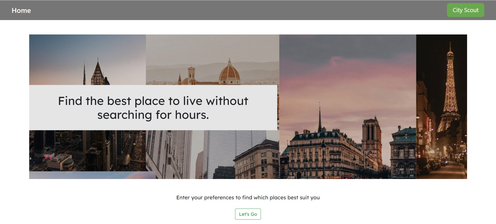
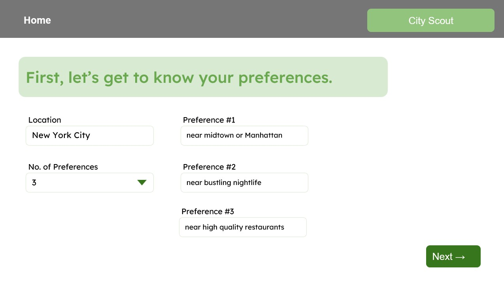
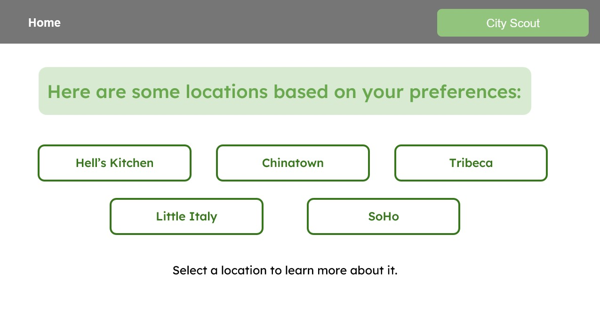
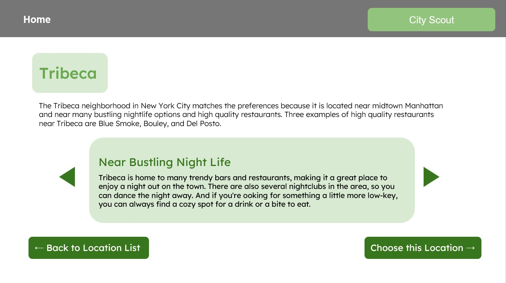
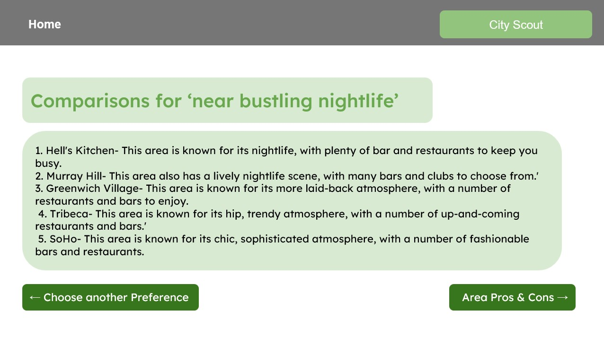
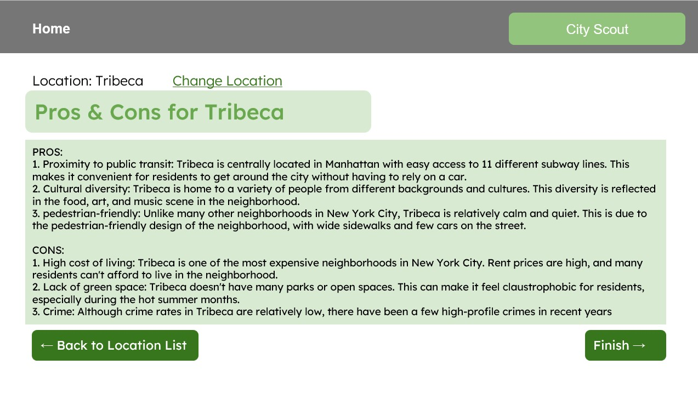

# GPT3-Neighborhoods
This App recommends neighborhoods in a city based on user preferences.
- Users: People that are looking to move into a new neighborhood
- Need: There are a lot of pros and cons for different cities, towns, etc so it gets difficult to 
choose the right place. Prospective tenants need a solution that can optimize their 
preferences. For example, a tenant would want a quiet neighborhood, close access to a 
subway, and nearby a dog friendly park.
- Solution: Using a recommendation system will help narrow down options for people 
without having to discover places the long way around.

Demo Youtube Link: https://youtu.be/WPYWaYYD9aM
| | |
|:-------------------------:|:-------------------------:|
| |  |
| |  |
| |  |
